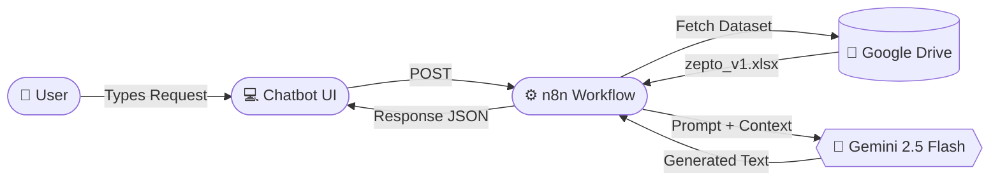
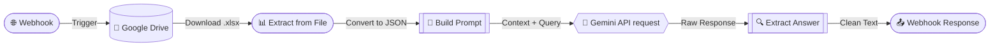

# Zepto Inventory NLP Assistant

A natural language query interface for Zepto's product inventory. Users ask plain English questions about products, prices, discounts, and stock levels — the system interprets the query against a structured dataset and returns a human-readable answer.

Built with **n8n** for workflow orchestration and **Google Gemini 2.5 Flash** as the language model.

---

## Table of Contents

- [Overview](#overview)
- [Architecture](#architecture)
- [Workflow Details](#workflow-details)
- [Dataset](#dataset)
- [Project Structure](#project-structure)
- [Tech Stack](#tech-stack)
- [Setup](#setup)
- [Example Queries](#example-queries)
- [Author](#author)

---

## Overview

The goal is to let users query a structured Excel inventory using natural language instead of writing filters or database queries. The system works as follows:

1. A user types a question in the chatbot frontend (e.g., *"Which products have more than 15% discount?"*).
2. The frontend sends the query to an n8n webhook.
3. n8n fetches the inventory spreadsheet from Google Drive, parses it, injects the data into a prompt, and sends it to Gemini.
4. Gemini interprets the query against the dataset and produces a natural language response.
5. The response is returned to the chatbot UI.

No database or search index is involved — the LLM acts as a dynamic query interpreter over raw tabular data passed in-context.

---

## Architecture

### End-to-End Flow



### n8n Workflow




---

## Workflow Details

Each node in the n8n workflow has a specific role:

| # | Node | Type | What it does |
|---|------|------|--------------|
| 1 | **Webhook** | Trigger | Listens for incoming POST requests at `/zepto-query`. Configured in `responseNode` mode so the workflow controls the HTTP response. |
| 2 | **Google Drive** | Data source | Downloads `zepto_v1.xlsx` from a Google Drive file ID. Requires OAuth credentials. |
| 3 | **Extract from File** | Parser | Converts the downloaded `.xlsx` binary into an array of JSON objects (one per row). |
| 4 | **Build Prompt** | Code (JS) | Takes the first 100 rows of parsed data and the user's query, then constructs a detailed system prompt. The prompt instructs Gemini to answer strictly from the dataset, convert prices from paise to rupees, and respond in natural paragraphs. |
| 5 | **HTTP Request** | API call | Sends the assembled prompt to the Gemini 2.5 Flash `generateContent` endpoint with a 1024-token output limit. |
| 6 | **Extract Answer** | Code (JS) | Pulls the generated text from `candidates[0].content.parts[0].text` in Gemini's response. |
| 7 | **Respond to Webhook** | Response | Returns the extracted answer as the HTTP response body to the chatbot frontend. |

---

## Dataset

**Source:** [Zepto Inventory Dataset (Kaggle)](https://www.kaggle.com)  
**File:** `zepto_v1.xlsx`

| Column | Description |
|--------|-------------|
| `Category` | Product category (e.g., Fruits and Vegetables, Dairy) |
| `name` | Product name |
| `mrp` | Maximum retail price, stored in **paise** |
| `discountPercent` | Discount percentage |
| `availableQuantity` | Units currently in stock |
| `discountedSellingPrice` | Price after discount, stored in **paise** |
| `weightInGms` | Product weight in grams |
| `outOfStock` | Boolean — `true` if unavailable |
| `quantity` | Quantity descriptor per unit |

> Prices are stored in paise (1/100th of a rupee). The prompt instructs the LLM to divide by 100 before displaying prices. For example, a value of `2500` is shown as ₹25.00.

---

## Project Structure

```
Task-1/
├── zepto_chatbot.html   # Frontend — single-page chatbot UI
├── n8n_workflow.json     # Exported n8n workflow (importable)
└── README.md             # This file
```

The frontend is a self-contained HTML file with inline CSS and JavaScript. It uses the `DM Mono` and `Syne` fonts, a dark theme, and communicates with the n8n webhook via `fetch`.

---

## Tech Stack

| Component | Technology | Role |
|-----------|-----------|------|
| Workflow engine | n8n Cloud | Orchestrates the full pipeline from webhook to response |
| Language model | Google Gemini 2.5 Flash | Interprets natural language queries against tabular data |
| Data storage | Google Drive | Hosts the inventory spreadsheet |
| Frontend | HTML / CSS / JS | Chat interface with typing indicators and suggestion chips |
| API testing | Hoppscotch | Used during development to test webhook payloads |

---

## Setup

### 1. Import the n8n workflow

1. Log in to [n8n Cloud](https://n8n.io).
2. Create a new workflow → menu (⋯) → **Import from file** → select `n8n_workflow.json`.
3. Configure credentials:
   - **Google Drive** — connect via OAuth.
   - **Gemini API** — get a free API key from [AI Studio](https://aistudio.google.com) and update the HTTP Request node URL.
4. Update the **Google Drive** node with your own file ID for `zepto_v1.xlsx`.
5. Activate the workflow.

### 2. Run the frontend

1. Open `zepto_chatbot.html` and replace the webhook URL placeholder:

```javascript
const WEBHOOK_URL = 'https://your-instance.app.n8n.cloud/webhook/zepto-query';
```

2. Serve the file locally. Any static file server works — for example, using XAMPP:
   - Copy `zepto_chatbot.html` to `C:\xampp\htdocs\NLP\`
   - Start Apache
   - Open `http://localhost/NLP/zepto_chatbot.html`

   Or simply open the file directly in a browser (the webhook call will still work if CORS is configured on your n8n instance).

---

## Example Queries

**"Which products have more than 15% discount?"**

> There are several products offering more than 15% discount. In the Fruits and Vegetables category, Garlic Indian leads with an 18% discount, followed by Capsicum and Carrot at 19% and 21% respectively. Beetroot offers an 18% discount and Broccoli comes in at 16%. Overall, the highest discount in the dataset is on Carrot at 23%.

**"What is the cheapest product available?"**

> The cheapest product currently available is Garlic Indian, priced at ₹9 after an 18% discount on its MRP of ₹11. It is in stock and available in a 100g pack.

**"List out of stock items"** and **"Show all dairy products"** are also supported — any question that can be answered from the dataset columns will produce a relevant response.

---

## Author

**Sriram Madala** 
